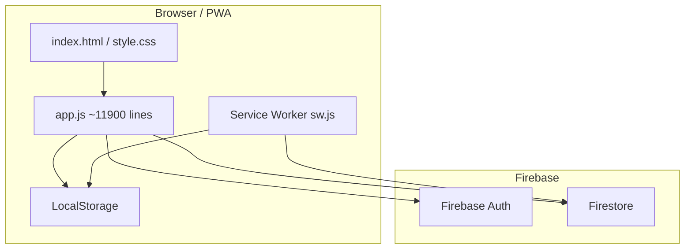
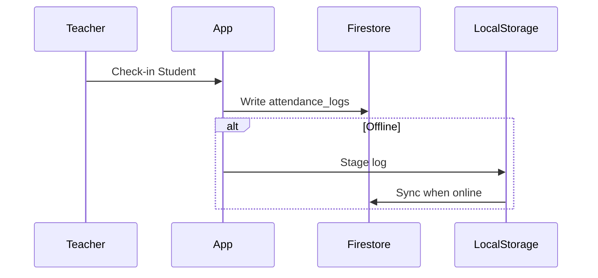
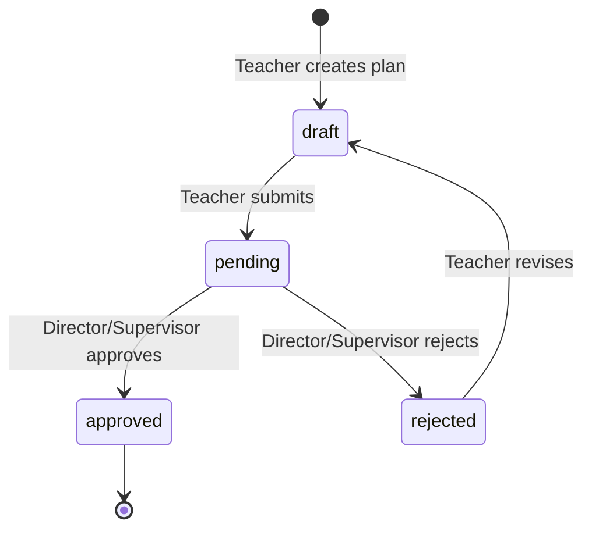

# ARCHITECTURE — Academic Management Platform (AMP)
### โรงเรียนไพวิทยาคาร | Version: v2.3.1

---

## ภาพรวม Architecture

แอปพลิเคชัน AMP ถูกออกแบบให้เป็น **Single Page Application (SPA)** ประเภท **Progressive Web App (PWA)** เพื่อรองรับการใช้งานในสภาพแวดล้อมที่การเชื่อมต่ออินเทอร์เน็ตอาจไม่เสถียร

| Layer | เทคโนโลยีที่ใช้ |
|---|---|
| **Frontend** | HTML5, Vanilla CSS, Vanilla JavaScript |
| **File Structure** | Single file architecture: `index.html`, `style.css`, `app.js` |
| **Backend** | Firebase Firestore (NoSQL), Firebase Authentication |
| **Database Topology** | จัดประเภทเอกสารรวม `system_data` กับคอลเลกชันแยกตาม [DATABASE_STANDARD.md](./DATABASE_STANDARD.md) |
| **Offline Support** | Service Worker (`sw.js`) + LocalStorage cache |
| **Build Tool** | ไม่มี — No build step, no bundler, no framework |

> [!NOTE]
> การเลือกใช้ Vanilla JavaScript แบบไม่มี framework ทำให้ deployment ง่าย ไม่ต้องการ Node.js environment และทำงานได้บนทุก static file host รวมถึง Firebase Hosting



---

## Authentication

ระบบยืนยันตัวตนใช้ **Firebase Authentication** แบบ email/password เป็นหลัก

- หลังจาก login สำเร็จ แอปจะตรวจสอบ **Role** ของผู้ใช้จาก Firestore collection `users`
- **Roles** ที่รองรับในระบบ:

| Role | คำอธิบาย |
|---|---|
| `admin` | ผู้ดูแลระบบสูงสุด |
| `teacher` | ครูผู้สอน |
| `director` | ผู้อำนวยการ |
| `supervisor` | ศึกษานิเทศก์ |
| `guest` | ผู้เข้าชมแบบอ่านอย่างเดียว |

- **Session** ถูกจัดการและเก็บรักษาโดย Firebase Auth SDK โดยอัตโนมัติ

---

## Attendance Module (การเข้าร่วมกิจกรรม)

Module นี้รองรับการบันทึกการเข้าร่วมกิจกรรมพอเพียงของนักเรียน โดยมีขั้นตอนดังนี้:

1. ครูเลือก **ฐานกิจกรรม** ที่ต้องการบันทึก
2. ครูเลือก **นักเรียน** จากรายชื่อในฐานนั้น
3. ระบบบันทึกการเข้าร่วมลงใน Firestore collection **`attendance_logs`**

**การทำงานแบบ Offline:**
- หากอุปกรณ์ไม่มีการเชื่อมต่อ ระบบจะเพิ่มข้อมูลลงใน **LocalStorage staging queue** ก่อน
- เมื่อกลับมา online ระบบจะ sync ข้อมูลที่ค้างไว้ไปยัง Firestore โดยอัตโนมัติ



---

## Academic Calendar Module (ปฏิทินรายวิชา)

Module นี้ช่วยให้ครูสร้างและจัดการปฏิทินการสอนรายวิชาผ่าน **5-Step Wizard**:

| Step | รายละเอียด |
|---|---|
| 1 | เลือกวิชาที่ต้องการสร้างปฏิทิน |
| 2 | กำหนดไตรมาส (Term) และช่วงเวลาสอน |
| 3 | กำหนดวันหยุดและวันพิเศษ |
| 4 | ระบบสร้างปฏิทินอัตโนมัติ |
| 5 | ครูยืนยันและบันทึกปฏิทิน |

- ข้อมูลปฏิทินทั้งหมดเก็บอยู่ใน Firestore collection **`subject_calendars`**
- **สถานะของแต่ละวันสอน:**
  - `taught` — สอนตามปกติ
  - `cancelled` — ยกเลิกการสอน
  - `makeup` — สอนชดเชย
- **Export:** รองรับการพิมพ์ผ่าน Print stylesheet

---

## Sufficiency Activity Planner (แผนกิจกรรมพอเพียง)

Module นี้ใช้สำหรับสร้างและจัดการ**แผนการจัดกิจกรรมการเรียนรู้ตามหลักปรัชญาเศรษฐกิจพอเพียง**

- ข้อมูลเก็บอยู่ใน Firestore collection **`lesson_plans`**

### Schema

```json
{
  "title": "string",
  "subject": "string",
  "grade": "string",
  "term": "number",
  "week": "number",
  "objectives": "string",
  "activities": "string",
  "materials": "string",
  "evaluation": "string",
  "framework": {
    "conditions": ["string"],
    "principles": ["string"],
    "dimensions": ["string"],
    "sciences": ["string"],
    "royalPolicies": ["string"]
  },
  "status": "draft | pending | approved | rejected",
  "teacherUid": "string",
  "createdAt": "Timestamp",
  "updatedAt": "Timestamp"
}
```

### Framework 2-3-4-3-4

ระบบมี **Checkbox Matrix UI** สำหรับให้ครูเลือกองค์ประกอบของปรัชญาเศรษฐกิจพอเพียง ตามโครงสร้าง **2-3-4-3-4** ซึ่งประกอบด้วย:

- **2** เงื่อนไข (conditions)
- **3** หลักการ (principles)
- **4** มิติ (dimensions)
- **3** ศาสตร์ (sciences)
- **4** นโยบายพระราชทาน (royalPolicies)

> [!TIP]
> ใน Detail view แต่ละรายการ framework ที่เลือกจะแสดงผลเป็น **Badge** เพื่อให้อ่านง่ายและสวยงาม

---

## Approval Workflow

ระบบมี Workflow การอนุมัติแผนกิจกรรมแบบ 4 สถานะ:

1. **Teacher** สร้างแผน → สถานะ `draft`
2. **Teacher** ส่งแผนเพื่อขออนุมัติ → สถานะ `pending`
3. **Director / Supervisor** พิจารณาและ:
   - อนุมัติ → สถานะ `approved`
   - ส่งกลับเพื่อแก้ไข → สถานะ `rejected`
4. **Teacher** แก้ไขแผนที่ถูกส่งคืน → กลับไปสถานะ `draft`



---

## Dashboard

หน้า Dashboard แสดงสรุปข้อมูลสำคัญของระบบ:

- **สถิติการเข้าร่วมกิจกรรม:** แสดงแบบรายวัน, รายสัปดาห์, และรายเดือน
- **Visualizations:** ใช้ **Chart.js** ในการแสดงกราฟและแผนภูมิต่าง ๆ
- **Pending Approval Count:** แสดงจำนวนแผนที่รอการอนุมัติ (สำหรับ Role `director` และ `supervisor` เท่านั้น)

---

## Rotation Schedule (Offline Edition)

Module จัดการตารางการหมุนเวียนฐานกิจกรรมประจำสัปดาห์

- บริหาร **Grid** การหมุนเวียนฐานให้กับแต่ละห้องเรียน/กลุ่ม
- ข้อมูลทั้งหมดเก็บอยู่ใน Firestore document เดียว: **`system_data/rotation_schedule`**
- ออกแบบให้ทำงานได้ดีแม้ในโหมด Offline

---

## Teaching Log Module (บันทึกผลการสอน)

Module บันทึกผลการจัดการเรียนรู้ การประเมินผลสัมฤทธิ์ และความคืบหน้าของการสอนจริงเทียบกับแผนกิจกรรมพอเพียง

- **การซิงค์คลาวด์:** เก็บเป็นอาเรย์ของออบเจกต์บันทึกภายใน document: `system_data/teaching_logs` พร้อม LocalStorage fallback `school_teaching_logs`
- **ฟังก์ชันสำคัญ:**
  - **Autofill จากแผนพอเพียง:** ครูสามารถดึงชื่อวิชา ชั้นเรียน ฐานเรียนรู้ และกรอบหลักปรัชญาของเศรษฐกิจพอเพียง (2-3-4-3-4) จากแผนกิจกรรมที่ได้รับการอนุมัติแล้ว
  - **สถานะและประเมินผลสัมฤทธิ์:** บันทึกเนื้อหาที่สอนจริง พฤติกรรมของนักเรียน และสรุปผลสัมฤทธิ์รายชั่วโมง
  - **Makeup teaching & status:** รองรับสถานะการสอน 4 รูปแบบ หากครูไม่ได้สอนตามแผนหรือสอนได้บางส่วน สามารถระบุความต้องการในการจัดกิจกรรมสอนชดเชยพร้อมกำหนดเวลาที่คาดว่าจะสอนชดเชยได้
  - **การข้ามสิทธิ์และมุมมองผู้ใช้:** แบ่งการกรองและการจำกัดสิทธิ์ (RBAC) เป็นไปตามเงื่อนไขที่กำหนด

---

## 🏗️ แผนการปรับปรุงสถาปัตยกรรม (Architecture Refactoring Plan)

เพื่อเตรียมพร้อมสำหรับการพัฒนาระบบระยะยาวและการเพิ่มโมดูล Teaching Log ระบบได้รับการวิเคราะห์และวางแผนปรับปรุงสถาปัตยกรรมดังนี้:
- **แผนผังความเกี่ยวเนื่องเชิงโมดูลเป้าหมาย:** รายละเอียดการแยกโมดูลย่อยสามารถศึกษาได้ที่ [MODULE_DEPENDENCY_MAP.md](./MODULE_DEPENDENCY_MAP.md)
- **ขั้นตอนการสกัดแยก app.js (8 เฟส):** ขั้นตอนโดยละเอียดสำหรับการสกัดไฟล์เดี่ยวออกเป็น ES Modules มีระบุใน [ARCHITECTURE_REFACTOR_PLAN.md](./ARCHITECTURE_REFACTOR_PLAN.md)
- **ดัชนีฟังก์ชันใน app.js:** ดัชนีเมธอดและแผนรายฟังก์ชันรวบรวมไว้ที่ [APPJS_FUNCTION_INDEX.md](./APPJS_FUNCTION_INDEX.md)

---

*เอกสารนี้อัปเดตล่าสุดสำหรับ AMP v2.3.1 — โรงเรียนไพวิทยาคาร*
