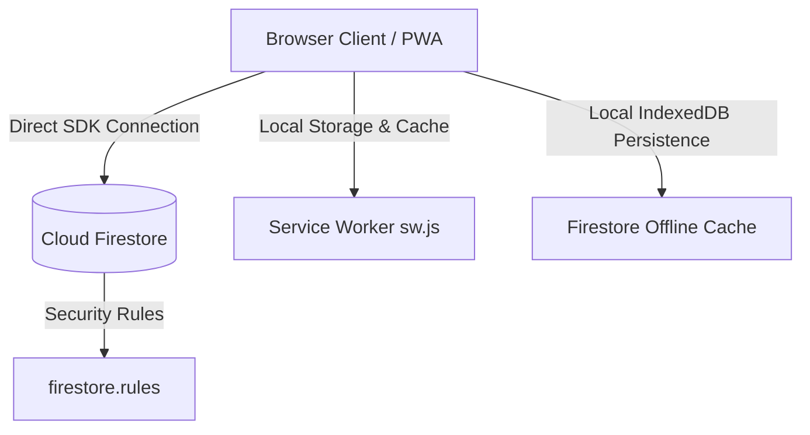

# ARCHITECTURE SUMMARY: Sufficiency Economy Attendance System

This document provides a comprehensive technical architectural audit and directory summary of the **Pai Wittyakarn School Student Attendance App (Core Engine)** after the completion of V1.0 (Security Baseline), V1.1 (Subject Calendar Wizard), and V1.2 (Rotation Schedule Builder).

---

## 1. Project Overview & Architecture

The application is built as a offline-first, highly responsive Progressive Web App (PWA) using a vanilla web stack (HTML5, Vanilla CSS, Vanilla JavaScript). It communicates directly with Firebase Firestore using the Firebase Web SDK v10.8.0 compatibility namespace.

### High-Level Architecture Diagram


---

## 2. File Structure & Project Manifest

| File / Directory | Purpose | Lines of Code | Status |
|---|---|---|---|
| [`index.html`](file:///C:/Users/jenpr/.gemini/antigravity/scratch/sufficiency-economy-attendance/index.html) | Single Page Application (SPA) structure, view containers, and 19 modal layouts. | ~2,470 | Verified |
| [`app.js`](file:///C:/Users/jenpr/.gemini/antigravity/scratch/sufficiency-economy-attendance/app.js) | Core application class (`AttendanceApp`) containing all data orchestration, UI rendering, offline cache logic, database helpers, and wizards. | ~10,630 | Verified |
| [`style.css`](file:///C:/Users/jenpr/.gemini/antigravity/scratch/sufficiency-economy-attendance/style.css) | Custom styling utilizing a natural sage green/earthy gold theme. | ~2,080 | Verified |
| [`sw.js`](file:///C:/Users/jenpr/.gemini/antigravity/scratch/sufficiency-economy-attendance/sw.js) | PWA Service Worker implementing a Stale-While-Revalidate caching strategy (excluding Firebase Auth/API calls). | 69 | Verified |
| [`firebase.json`](file:///C:/Users/jenpr/.gemini/antigravity/scratch/sufficiency-economy-attendance/firebase.json) | Firebase configuration defining Singapore region (`asia-southeast1`) and paths to rules/indexes. | 9 | Verified |
| [`.firebaserc`](file:///C:/Users/jenpr/.gemini/antigravity/scratch/sufficiency-economy-attendance/.firebaserc) | Firebase project bindings (maps to `paiwittyakarn-attendance` project). | 6 | Verified |
| [`firestore.rules`](file:///C:/Users/jenpr/.gemini/antigravity/scratch/sufficiency-economy-attendance/firestore.rules) | Declarative Firestore security rules defining default deny and role-based path restrictions. | 203 | Verified |
| [`firestore.indexes.json`](file:///C:/Users/jenpr/.gemini/antigravity/scratch/sufficiency-economy-attendance/firestore.indexes.json) | Composite queries indexes for Subject Calendars and Lessons search. | 51 | Verified |
| [`manifest.json`](file:///C:/Users/jenpr/.gemini/antigravity/scratch/sufficiency-economy-attendance/manifest.json) | Web App Manifest defining short name, theme colors, icons, and standalone app display parameters. | 25 | Verified |

---

## 3. Major Modules & Methods in `app.js`

The `AttendanceApp` class encapsulates all application capabilities. Key functional categories and their associated methods include:

### 3.1 Initialization & Cloud/Local Storage Synchronization
- `init()`: Orchestrates PWA service worker registration, Firestore setup, local DB bootstrap, UI binding, and background cloud sync.
- `initFirestore()`: Configures Firebase compatibility client, enables IndexedDB offline persistence, and listens to auth state changes.
- `loadDatabase()` / `loadDatabaseFromLocalStorage()`: Pulls student lists, active rotation schedules, semesters, and calendars.
- `saveDatabase(forceCloud, collectionsToSync)`: Serializes database properties back to LocalStorage and pushes delta logs to Firestore.

### 3.2 Authentication & Login Recovery
- `login()`: Validates inputs, coordinates Firebase Auth email signIn, and maps user profiles to internal role permissions.
- `logout()`: Clears sessionStorage/localStorage credentials and calls Firebase signOut.
- `handleForgotPassword()` / `sendFirebasePasswordReset()`: Triggers email recovery templates for locked-out staff.
- `retryLoginProfileLoad()`: Fallback recovery routine when Firestore is slow to load but authentication succeeds.
- `runUserDataIntegrityCheck()`: Post-login data diagnostic suite to detect corrupt references, dangling UIDs, or duplicate profiles.

### 3.3 Attendance & Check-in Execution
- `renderCheckin()` / `renderCheckinStudentList()`: Main UI loader for base-specific and classroom-specific student evaluation cards.
- `setStudentStatus()`: Registers individual presence (Present, Late, Absent, Sick/Leave, Activity).
- `saveCurrentAttendance()`: Generates local staging log batches, captures evaluation ratings, post-activity comments, uploaded files, and stages them for sync.

### 3.4 Subject Calendar Wizard (V1.1)
- `openCalendarWizard()` / `showWizardStep()`: Stepwise flow for teachers/admins to declare custom academic calendars.
- `generatePreviewLessons()`: Generates lesson templates on corresponding weekdays in a date range before committing.
- `confirmAndGenerateCalendar()`: Creates records in `subjectCalendars` and bulk uploads `subjectCalendarLessons`.
- `viewLessons()` / `renderLessonsList()`: Lists lessons for a calendar with classroom/status filters.
- `openMakeupLessonModal()` / `saveMakeupLesson()`: Registers custom make-up lessons outside standard schedules.

### 3.5 Rotation Schedule Builder (V1.2)
- `openRotationBuilder(isEdit)`: Launches the 5-step modal. If `isEdit` is true, loads current active schedule to edit.
- `executeAutoRotation()`: Algorithmically rotates M.1-M.6 grades across active learning bases on weekly cycles.
- `renderBuilderPreviewTable()`: Generates editable weeks (rows) x bases (columns) grid for manual cell overrides.
- `saveRotationBuilderSchedule()`: Validates parameters, writes updated bases list, commits schedule matrix, and triggers view refresh.

---

## 4. Firestore Data Model & Collections

The application utilizes 9 distinct document schemas stored within cloud collections:

| Collection | Doc ID Pattern | Purpose / Content | Read Roles | Write Roles | Risks / Constraints |
|---|---|---|---|---|---|
| `system_data` | `bases`, `rotation_schedule`, `activeSemesterId` | Config parameters containing details of bases, classes, and current semester. | All Auth Staff | Admin Only | Larger document size. Large arrays may hit the 1MB document limit over time. |
| `attendance_logs` | Auto-generated ID | Individual student check-in records containing statuses, activity scores, evaluation text, and media URLs. | Admin, Director, Supervisor, Owner Teacher | Admin, Owner Teacher | Very high volume. Requires indexing for query performance. |
| `base_activity_logs` | Auto-generated ID | General session notes, photos, and evaluation logs for learning bases. | All Auth Staff | Admin, Teacher | Large photo payloads require efficient storage mapping. |
| `staging_logs` | Auto-generated ID | Local check-ins cached during offline periods, waiting to sync when connection is restored. | All Auth Staff | Admin, Teacher (Delete: Admin, Director, Supervisor) | Synchronization conflicts if offline cache is cleared. |
| `userProfiles` | User UID | Basic profiles containing teacher names, teaching bases, and statuses. | Self, Admin | Admin Only | Profile state mismatch if Auth DB is altered manually. |
| `userAccounts` | User UID | Account configurations containing role classifications and login audit logs. | Self, Admin | Admin Only (Self updates login timestamps) | Crucial document for system authorization. |
| `subjectCalendars` | Auto-generated ID | Meta descriptions of academic subject schedules (teacher UID, code, grade, dates). | Admin, Director, Supervisor, Owner Teacher | Admin, Owner Teacher | High query frequency. Needs composite index for sorting. |
| `subjectCalendarLessons`| Auto-generated ID | Granular classroom lessons (date, period, topic, plan, notes, status). | Admin, Director, Supervisor, Owner Teacher | Admin, Owner Teacher | High document count per calendar. Requires calendarId queries. |
| `backups` | Auto-generated ID | Complete system backups saved as JSON strings. | Admin Only | Admin Only | Rapid storage growth. Needs automated deletion policy. |
| `audit_logs` | Auto-generated ID | Immutable administrative audit trails. | Admin Only | All Auth Staff (Create Only) | Document count grows indefinitely. Updates are disabled. |

---

## 5. Security Rules Summary (`firestore.rules`)

The system follows a strict **zero-trust/default-deny security model**.

### 5.1 Base Rules Configuration
```javascript
// Default Deny Rule
match /{document=**} {
  allow read, write: if false;
}
```

### 5.2 Path Protections
- **`userAccounts` & `userProfiles`**: Read is restricted to the owner (`request.auth.uid == uid`) or the `admin`. Updates by users are restricted to non-privileged fields (`lastLoginAt`, `activatedAt`, `status`) via diff verification to prevent privilege escalation.
- **`system_data`**: Any authenticated staff member can read configuration files. Only `admin` can write.
- **`attendance_logs` & `subjectCalendars` / `subjectCalendarLessons`**:
  - `admin`, `director`, and `supervisor` can read all logs.
  - `teacher` can only read documents where `resource.data.teacherUid == request.auth.uid`.
  - `teacher` can only create/update documents where `request.resource.data.teacherUid == request.auth.uid` (or matching their username via `checkedBy`).
  - Deletions are restricted to `admin` only.
- **`audit_logs`**: Authenticated users can write audit logs on action. No updates or deletions are allowed under any circumstances.

---

## 6. Role Model Matrix

| Role | Navigation Views | Write Actions Allowed | Read Scopes |
|---|---|---|---|
| **Admin** | All views active. | Full permissions. | Full access to all data. |
| **Teacher** | Check-in, Subject Calendar, Teacher History, Rotation. | Record attendance, manage own calendars, add own make-up lessons. | Can view only their own calendars/attendance logs. |
| **Director / Supervisor** | Dashboard, Calendar, Bases, Rotation, Search, Reports, Admin. | View-only (No edit or create). Can approve/delete from Staging Queue. | Can view all calendars, logs, and base activity reviews. |
| **Unauthenticated Guest**| Dashboard, Calendar, Bases, Rotation, Search. | None. | Can view basic schedule information. Cannot see student profiles. |

---

## 7. Version Release History

### v1.0.0 Security Baseline
- **Features**: Core attendance check-in, SQLite/LocalStorage backup syncing, offline staging logs queue.
- **Security**: Introduced default-deny rules, role authorization levels, password change modal enforce, and audit logger.

### v1.1.0 Subject Calendar Wizard
- **Features**: 5-step calendar generator wizard, taught/cancelled status toggles, notes/plan recorder, and PDF/Print stylesheet.
- **Improvements**: Complete removal of legacy Base Activity UI from the Subject Calendar page to prevent layout confusion.

### v1.2.0 Rotation Schedule Builder
- **Features**: Admin-only weekly schedule constructor wizard, active base CRUD reordering, grade auto-rotation calculation, and matrix grid editor.

---

## 8. Remaining Technical Debt & Risks

### 8.1 Technical Debt
1. **God Class Pattern**: `app.js` is over 10,600 lines long, housing UI bindings, wizards, business logic, API calls, and charts. It should be refactored into modular components.
2. **DOM XSS Vulnerability**: Extensive use of `innerHTML` for dynamic templates. Inputs must be sanitized to prevent scripts injection.
3. **Large Document Risk**: `system_data/rotation_schedule` is stored as an array of objects inside a single document. If the school increases week counts beyond 30 or doubles learning bases, the document size might exceed Firestore's 1MB limit.

### 8.2 Production Readiness Status

> [!IMPORTANT]
> **Status: Ready for Pilot Run**
> The application is stable and fully functional for a pilot program with a single grade level or subset of teachers. However, a manual verification pass must be completed before rolling out to the entire school.

#### Pre-Rollout Manual Testing Checklist:
1. **PWA Offline Mode**: Disable network connection on a tablet, check in students, re-enable connection, and verify staging queue logs sync correctly to Firestore.
2. **Role Escalation**: Verify a user logged in as a teacher cannot access `/system_data` writes or view other teachers' calendars by testing requests with simulated auth context.
3. **Large Database Scaling**: Verify query response times when the database contains 1,000+ students and 50,000+ attendance log entries.

---
*Document prepared by Antigravity on 2026-07-02.*
