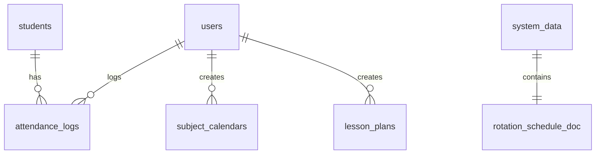

# DATABASE — Academic Management Platform (AMP)
**โรงเรียนไพวิทยาคาร** | Version: `v2.3.1` | Database: **Firebase Firestore**

---

## ภาพรวมโครงสร้างฐานข้อมูล

| รายการ | รายละเอียด |
|---|---|
| **Database Type** | Cloud Firestore (NoSQL Document Database) |
| **Region** | `asia-southeast1` |
| **โครงสร้าง** | Collection > Document > Fields |
| **มาตรฐานระบบ** | ดูรายละเอียดโครงสร้างสถาปัตยกรรมที่ [DATABASE_STANDARD.md](./DATABASE_STANDARD.md) |

ฐานข้อมูลใช้รูปแบบ NoSQL Document Database ซึ่งข้อมูลถูกจัดกลุ่มเป็น Collection แต่ละ Collection ประกอบด้วย Document และแต่ละ Document มี Fields เก็บข้อมูลจริง ไม่มี schema บังคับ แต่ระบบ AMP กำหนดโครงสร้าง Fields ให้สอดคล้องกันทั่วทั้งแอปพลิเคชันตามแนวปฏิบัติมาตรฐานเพื่อป้องกันปัญหาเอกสารขนาดเกิน 1MB และการควบคุมความปลอดภัยระดับบทบาทผู้ใช้งาน (RBAC)

### ความสัมพันธ์ระหว่าง Collections



---

## Collections ปัจจุบัน

### `users`

เก็บข้อมูลผู้ใช้งานทุกคนในระบบ ไม่ว่าจะเป็นครู ผู้บริหาร ศึกษานิเทศก์ หรือ admin

- **Document ID**: Firebase Auth UID (กำหนดโดย Firebase Authentication อัตโนมัติ)

| Field | Type | คำอธิบาย |
|---|---|---|
| `email` | `string` | อีเมลที่ใช้ล็อกอิน |
| `name` | `string` | ชื่อ-นามสกุลผู้ใช้งาน |
| `role` | `string` | สิทธิ์การใช้งาน: `admin` \| `teacher` \| `director` \| `supervisor` \| `guest` |
| `bases` | `array` | รายชื่อฐานการเรียนรู้ที่รับผิดชอบ *(teacher only)* |
| `grade` | `string` | ระดับชั้นที่ดูแล *(teacher only)* |
| `createdAt` | `timestamp` | วันเวลาที่สร้างบัญชี |
| `updatedAt` | `timestamp` | วันเวลาที่แก้ไขล่าสุด |

> [!NOTE]
> Field `bases` และ `grade` จะมีค่าเฉพาะ document ของผู้ใช้ที่มี `role = "teacher"` เท่านั้น สำหรับ role อื่นจะเป็น `null` หรือไม่มี field นี้

---

### `students`

เก็บข้อมูลนักเรียนทั้งหมดในโรงเรียน ใช้อ้างอิงในการบันทึกการเข้าร่วมกิจกรรม

- **Document ID**: auto-generated (Firestore สร้างให้อัตโนมัติ)

| Field | Type | คำอธิบาย |
|---|---|---|
| `studentId` | `string` | เลขประจำตัวนักเรียน |
| `name` | `string` | ชื่อ-นามสกุล |
| `grade` | `string` | ระดับชั้น: ม.1 – ม.6 |
| `class` | `string` | ห้องเรียน เช่น `1/1`, `3/2` |
| `isActive` | `boolean` | สถานะนักเรียน (`true` = กำลังศึกษา) |
| `createdAt` | `timestamp` | วันเวลาที่เพิ่มข้อมูล |

---

### `attendance_logs`

บันทึกการเข้าร่วมกิจกรรมฐานการเรียนรู้เศรษฐกิจพอเพียงของนักเรียนแต่ละคน

- **Document ID**: auto-generated

| Field | Type | คำอธิบาย |
|---|---|---|
| `studentId` | `string` | อ้างอิง Document ID จาก collection `students` |
| `studentName` | `string` | ชื่อนักเรียน (denormalized เพื่อความเร็ว) |
| `base` | `string` | ชื่อฐานการเรียนรู้ที่เข้าร่วม |
| `grade` | `string` | ระดับชั้นของนักเรียน |
| `status` | `string` | สถานะ: `present` \| `absent` \| `late` \| `leave` |
| `date` | `string` | วันที่ในรูปแบบ ISO 8601: `YYYY-MM-DD` |
| `week` | `number` | สัปดาห์ที่ของภาคเรียน |
| `term` | `number` | ภาคเรียน (`1` หรือ `2`) |
| `teacherUid` | `string` | Firebase Auth UID ของครูผู้บันทึก |
| `createdAt` | `timestamp` | วันเวลาที่บันทึก |

> [!IMPORTANT]
> **Composite Indexes** ที่จำเป็น:
> - `grade + date` — สำหรับ query รายงานรายชั้นตามวันที่
> - `studentId + date` — สำหรับ query ประวัตินักเรียนรายคน
> - `teacherUid + date` — สำหรับ query บันทึกของครูแต่ละคน

---

### `subject_calendars`

ปฏิทินรายวิชาของครูแต่ละคน เก็บแผนการสอนตลอดภาคเรียนในรูปแบบ array of lesson objects

- **Document ID**: auto-generated (หนึ่ง document ต่อหนึ่ง teacher-subject-term)

| Field | Type | คำอธิบาย |
|---|---|---|
| `teacherUid` | `string` | UID ของครูเจ้าของปฏิทิน |
| `subject` | `string` | ชื่อวิชา |
| `grade` | `string` | ระดับชั้น |
| `term` | `number` | ภาคเรียน |
| `academicYear` | `string` | ปีการศึกษา เช่น `"2567"` |
| `totalWeeks` | `number` | จำนวนสัปดาห์ทั้งหมดในภาคเรียน |
| `startDate` | `string` | วันเริ่มต้นภาคเรียน (ISO date) |
| `holidays` | `array<string>` | รายการวันหยุด (ISO date format) |
| `lessons` | `array<object>` | แผนการสอนรายสัปดาห์: `{week, date, topic, plan, notes, status}` |
| `createdAt` | `timestamp` | วันเวลาที่สร้าง |
| `updatedAt` | `timestamp` | วันเวลาที่แก้ไขล่าสุด |

> [!IMPORTANT]
> **Composite Indexes** ที่จำเป็น:
> - `teacherUid + term` — สำหรับโหลดปฏิทินของครูตามภาคเรียน
> - `grade + term` — สำหรับ query ภาพรวมรายชั้น

---

### `lesson_plans`

แผนกิจกรรมเศรษฐกิจพอเพียง ใช้ workflow การอนุมัติจากผู้บริหาร/ศึกษานิเทศก์

- **Document ID**: auto-generated

| Field | Type | คำอธิบาย |
|---|---|---|
| `teacherUid` | `string` | UID ของครูผู้สร้างแผน |
| `title` | `string` | ชื่อแผนกิจกรรม |
| `subject` | `string` | วิชา |
| `grade` | `string` | ระดับชั้น |
| `term` | `number` | ภาคเรียน |
| `week` | `number` | สัปดาห์ที่ |
| `objectives` | `string` | จุดประสงค์การเรียนรู้ |
| `activities` | `string` | กิจกรรมการเรียนรู้ |
| `materials` | `string` | สื่อ/อุปกรณ์ที่ใช้ |
| `evaluation` | `string` | การวัดและประเมินผล |
| `framework` | `object` | กรอบหลักปรัชญาเศรษฐกิจพอเพียง (ดูรายละเอียดด้านล่าง) |
| `status` | `string` | สถานะ: `draft` \| `pending` \| `approved` \| `rejected` |
| `directorComment` | `string` | ความเห็นจากผู้อำนวยการ |
| `supervisorComment` | `string` | ความเห็นจากศึกษานิเทศก์ |
| `reviewedBy` | `string` | UID ของผู้อนุมัติ/ปฏิเสธ |
| `reviewedAt` | `timestamp` | วันเวลาที่ review |
| `createdAt` | `timestamp` | วันเวลาที่สร้าง |
| `updatedAt` | `timestamp` | วันเวลาที่แก้ไขล่าสุด |

#### โครงสร้าง `framework` Object

```json
{
  "framework": {
    "conditions":    ["string"],
    "principles":    ["string"],
    "dimensions":    ["string"],
    "sciences":      ["string"],
    "royalPolicies": ["string"]
  }
}
```

| Sub-field | คำอธิบาย |
|---|---|
| `conditions` | เงื่อนไข 2 ประการ (ความรู้ / คุณธรรม) |
| `principles` | หลัก 3 ประการ (พอประมาณ / มีเหตุผล / มีภูมิคุ้มกัน) |
| `dimensions` | มิติ 4 ด้าน (เศรษฐกิจ / สังคม / สิ่งแวดล้อม / วัฒนธรรม) |
| `sciences` | ศาสตร์ 3 ด้าน |
| `royalPolicies` | พระราโชบาย 4 ด้าน |

> [!IMPORTANT]
> **Composite Indexes** ที่จำเป็น:
> - `teacherUid + status` — สำหรับครูดูแผนตาม status ของตนเอง
> - `grade + status` — สำหรับผู้บริหาร/ศึกษานิเทศก์ review รายชั้น
> - `status + createdAt` — สำหรับ queue การอนุมัติเรียงตามเวลา

---

### `system_data` *(Special Collection)*

Collection พิเศษที่เก็บการตั้งค่าระบบและข้อมูล global Document IDs เป็น fixed string (ไม่ใช่ auto-generated)

---

#### Document: `rotation_schedule`

ตารางการหมุนเวียนฐานการเรียนรู้

| Field | Type | คำอธิบาย |
|---|---|---|
| `bases` | `array<object>` | รายการฐาน: `{name, teacher, grade, order}` |
| `schedule` | `array<object>` | ตารางรายสัปดาห์: `{week, assignments: {grade: baseName}}` |
| `updatedAt` | `timestamp` | วันเวลาที่อัปเดตล่าสุด |
| `updatedBy` | `string` | UID ของผู้อัปเดต |

#### Document: `settings`

การตั้งค่าโรงเรียนและปีการศึกษาปัจจุบัน

| Field | Type | คำอธิบาย |
|---|---|---|
| `schoolName` | `string` | ชื่อโรงเรียน |
| `currentTerm` | `number` | ภาคเรียนปัจจุบัน |
| `currentYear` | `string` | ปีการศึกษาปัจจุบัน เช่น `"2567"` |
| `academicStartDate` | `string` | วันเปิดภาคเรียน (ISO date) |

> [!NOTE]
> เข้าถึง document เหล่านี้ด้วย path: `system_data/rotation_schedule`, `system_data/settings` และ `system_data/lesson_plans`

---

### `teaching_logs` *(v2.3)*

คอลเลกชันเก็บประวัติผลการจัดการเรียนรู้ของครูแต่ละคาบ แยกรายเอกสารเพื่อรองรับการเติบโตของข้อมูลและความปลอดภัยระดับแถว (Row-Level Security) บูรณาการหลักปรัชญาของเศรษฐกิจพอเพียง

- **Document ID**: auto-generated หรือกำหนดเป็น `tl_timestamp`

| Field | Type | คำอธิบาย |
|---|---|---|
| `logId` | `string` | ID บันทึก (รูปแบบ `tl_timestamp`) |
| `lessonPlanId` | `string \| null` | อ้างอิงแผนกิจกรรมจาก `lesson_plans` |
| `attendanceLogId` | `string \| null` | อ้างอิงบันทึกเช็กชื่อ |
| `teacherUid` | `string` | UID ผู้เขียนบันทึก |
| `teacherId` | `string` | Username ผู้เขียนบันทึก |
| `teacherName` | `string` | ชื่อ-นามสกุลครูผู้บันทึก |
| `academicYear` | `string` | ปีการศึกษา เช่น `"2569"` |
| `semester` | `string` | ภาคเรียน เช่น `"1"` |
| `weekNumber` | `string` | สัปดาห์การเรียนรู้ |
| `logDate` | `string` | วันที่สอน (รูปแบบ `YYYY-MM-DD`) |
| `subjectName` | `string` | ชื่อวิชาหรือหัวข้อที่จัดกิจกรรม |
| `subjectCode` | `string` | รหัสวิชา (ถ้ามี) |
| `gradeLevel` | `string` | ระดับชั้น ม.1 - ม.6 |
| `className` | `string` | ห้องเรียน เช่น `"ม.1/1"` |
| `baseId` | `string \| null` | อ้างอิงฐานการเรียนรู้ |
| `baseName` | `string \| null` | ชื่อฐานการเรียนรู้ |
| `teachingStatus` | `string` | สถานะ: `taught_as_planned` \| `partially_taught` \| `not_taught` \| `rescheduled` |
| `taughtContent` | `string` | เนื้อหา/กิจกรรมที่สอนจริง |
| `studentParticipation` | `string` | การมีส่วนร่วมของนักเรียน |
| `learningOutcome` | `string` | ผลสัมฤทธิ์ทางการเรียนรู้ |
| `problems` | `string` | ปัญหา/อุปสรรคที่พบ |
| `solutions` | `string` | แนวทางการแก้ปัญหา |
| `nextPlan` | `string` | แผนชั่วโมงถัดไป |
| `makeupRequired` | `boolean` | ต้องสอนชดเชยหรือไม่ |
| `makeupDate` | `string \| null` | วันที่สอนชดเชย |
| `notes` | `string` | บันทึกเพิ่มเติม |
| `linkedFramework` | `object` | กรอบบูรณาการเศรษฐกิจพอเพียง (โครงสร้างเช่นเดียวกับ `framework` ใน `lesson_plans`) |
| `createdAt` | `string` | ISO timestamp วันที่สร้าง |
| `updatedAt` | `string` | ISO timestamp วันที่แก้ไขล่าสุด |

---

## Future Collections *(โครงสร้างที่วางแผนไว้)*

### `resources` *(v2.4)*

คลังสื่อและทรัพยากรการเรียนรู้

| Field | Type | คำอธิบาย |
|---|---|---|
| `title` | `string` | ชื่อสื่อ |
| `type` | `string` | ประเภท: `pdf` \| `video` \| `ppt` |
| `url` | `string` | URL ของไฟล์ (Firebase Storage หรือ external) |
| `subject` | `string` | วิชาที่เกี่ยวข้อง |
| `grade` | `string` | ระดับชั้น |
| `uploadedBy` | `string` | `teacherUid` ของผู้อัปโหลด |
| `tags` | `array<string>` | tag คำสำคัญสำหรับค้นหา |
| `createdAt` | `timestamp` | วันเวลาที่อัปโหลด |

---

## Indexes (`firestore.indexes.json`)

Composite indexes ทั้งหมดที่ต้องประกาศใน `firestore.indexes.json`:

```json
{
  "indexes": [
    {
      "collectionGroup": "attendance_logs",
      "queryScope": "COLLECTION",
      "fields": [
        { "fieldPath": "grade", "order": "ASCENDING" },
        { "fieldPath": "date",  "order": "ASCENDING" }
      ]
    },
    {
      "collectionGroup": "attendance_logs",
      "queryScope": "COLLECTION",
      "fields": [
        { "fieldPath": "studentId", "order": "ASCENDING" },
        { "fieldPath": "date",      "order": "ASCENDING" }
      ]
    },
    {
      "collectionGroup": "lesson_plans",
      "queryScope": "COLLECTION",
      "fields": [
        { "fieldPath": "teacherUid", "order": "ASCENDING" },
        { "fieldPath": "status",     "order": "ASCENDING" }
      ]
    },
    {
      "collectionGroup": "lesson_plans",
      "queryScope": "COLLECTION",
      "fields": [
        { "fieldPath": "status",    "order": "ASCENDING" },
        { "fieldPath": "createdAt", "order": "DESCENDING" }
      ]
    },
    {
      "collectionGroup": "subject_calendars",
      "queryScope": "COLLECTION",
      "fields": [
        { "fieldPath": "teacherUid", "order": "ASCENDING" },
        { "fieldPath": "term",       "order": "ASCENDING" }
      ]
    }
  ]
}
```

### สรุป Indexes รายการ

| Collection | Fields | วัตถุประสงค์ |
|---|---|---|
| `attendance_logs` | `grade` + `date` | รายงานการเข้าร่วมรายชั้น |
| `attendance_logs` | `studentId` + `date` | ประวัตินักเรียนรายคน |
| `lesson_plans` | `teacherUid` + `status` | แผนงานของครูตาม status |
| `lesson_plans` | `status` + `createdAt` | คิวการอนุมัติ |
| `subject_calendars` | `teacherUid` + `term` | ปฏิทินของครูตามภาคเรียน |

> [!WARNING]
> หากไม่ได้ deploy `firestore.indexes.json` ก่อนใช้งาน query ที่ต้องการ composite index Firestore จะ throw error `The query requires an index` ซึ่งจะทำให้แอปพลิเคชันทำงานผิดปกติ

---

*เอกสารนี้อัปเดตครั้งล่าสุด: v2.2.0 — Academic Management Platform (AMP) โรงเรียนไพวิทยาคาร*
