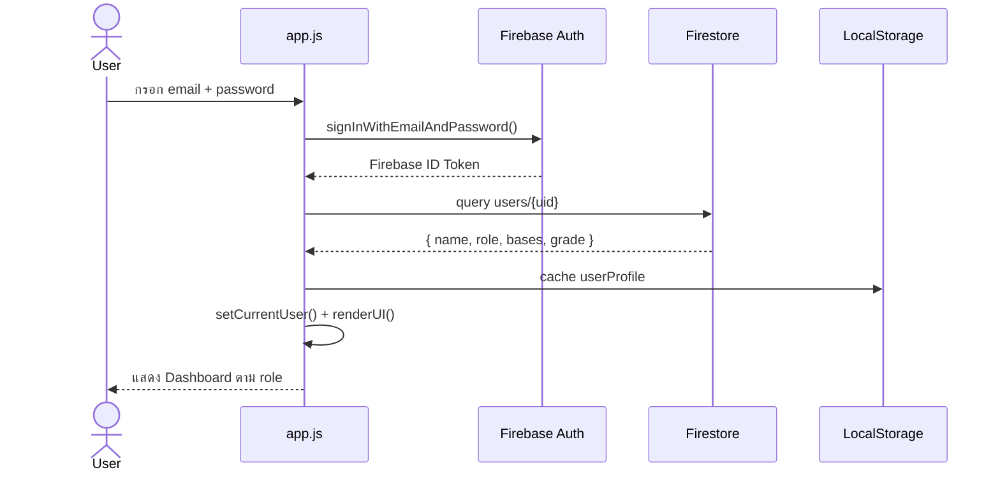
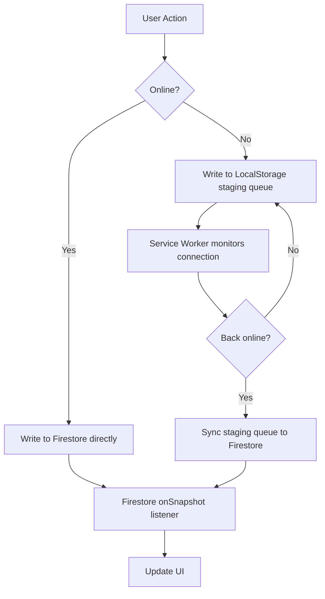
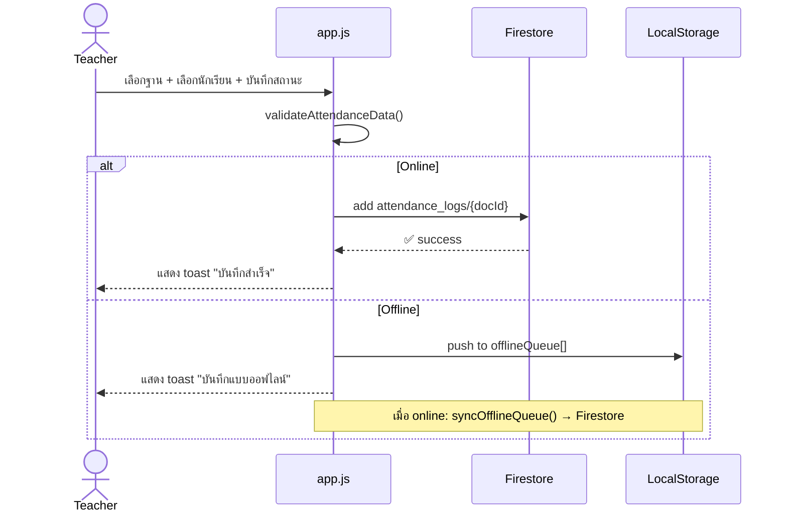
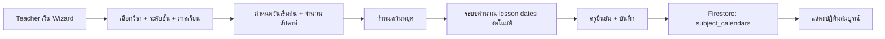
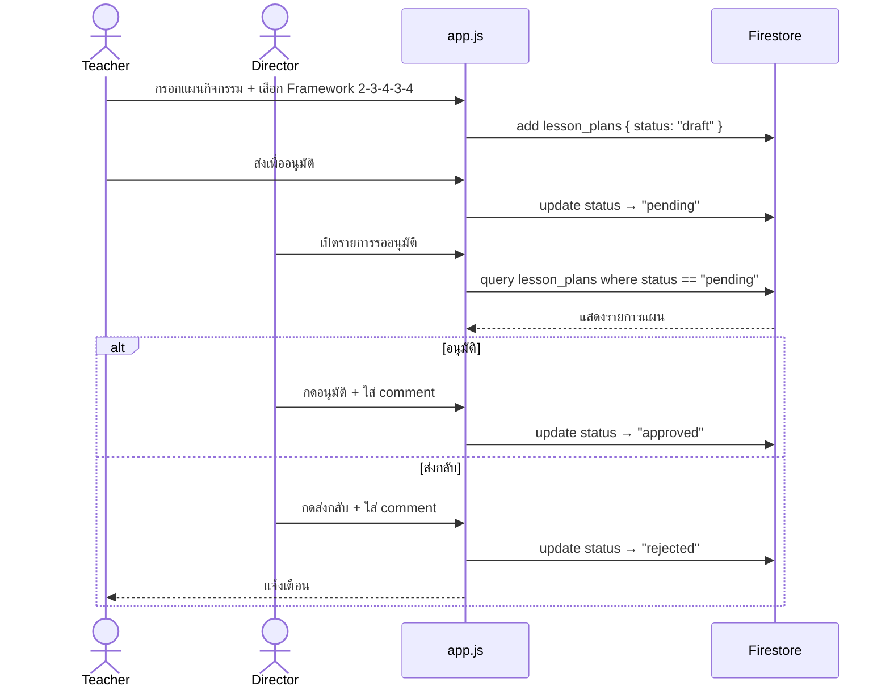
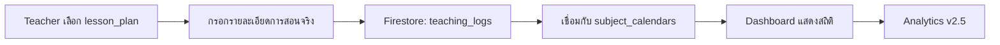
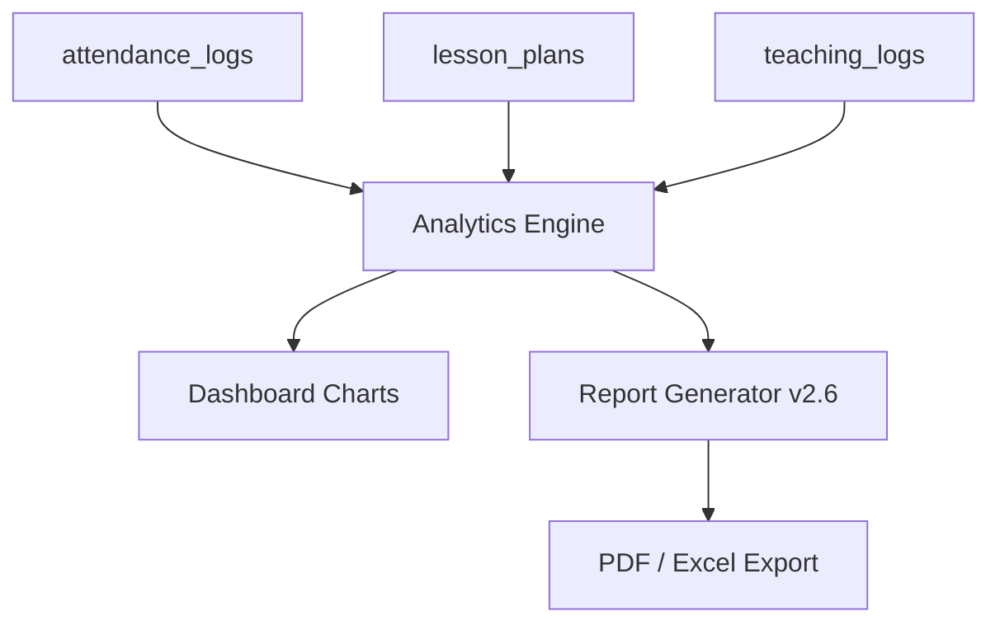
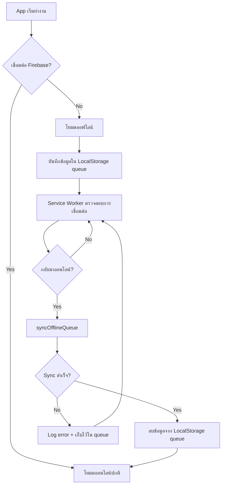
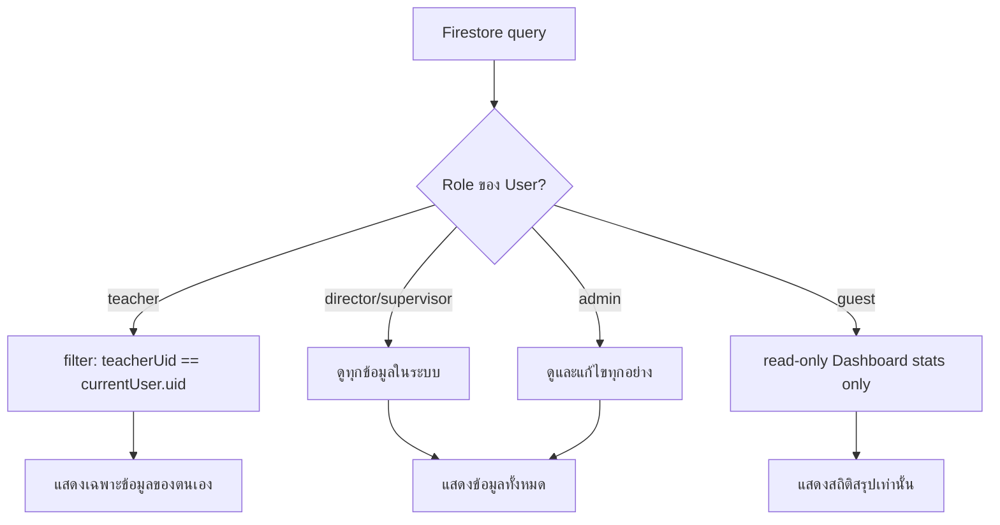

# 🔄 การไหลของข้อมูล (Data Flow)

**Academic Management Platform (AMP)** — โรงเรียนไพวิทยาคาร | Version: v2.2.0

เอกสารนี้อธิบายการเคลื่อนย้ายข้อมูลผ่านระบบในทุก scenario หลัก

> [!NOTE]
> ดู DATABASE.md สำหรับโครงสร้าง collection และ ARCHITECTURE.md สำหรับ architecture ภาพรวม

---

## 1. 🔐 Login Flow (การเข้าสู่ระบบ)

**หมายเหตุ:**
- ถ้า Firebase ออฟไลน์ขณะ login → แสดง error, ไม่มี offline fallback สำหรับ login
- Role จะถูก cache ใน LocalStorage เพื่อใช้ render UI ระหว่าง session

---

## 2. 🌿 Firestore Read/Write Flow

---

## 3. 📋 Local Cache Flow (การแคชข้อมูลในเครื่อง)

ข้อมูลที่ cache ใน LocalStorage:

| Key | เนื้อหา | อัปเดตเมื่อ |
|---|---|---|
| `userProfile` | ชื่อ, role, bases, grade | login / reload |
| `offlineQueue` | attendance logs ที่รอ sync | ทุกครั้งที่ offline check-in |
| `rotationCache` | ตารางหมุนเวียนล่าสุด | อัปเดตจาก Firestore |
| `appSettings` | schoolName, term, year | โหลดจาก system_data |

---

## 4. ✅ Attendance Data Flow (การบันทึกการเข้าร่วม)

---

## 5. 📅 Academic Calendar Data Flow (ปฏิทินรายวิชา)

---

## 6. 🌱 Sufficiency Activity Planner Data Flow

---

## 7. 📝 Teaching Log Data Flow (วางแผน v2.3)

---

## 8. 📊 Analytics Data Flow (วางแผน v2.5)

---

## 9. 🔄 Offline Sync Flow (การซิงก์เมื่อออฟไลน์)

**ข้อจำกัดที่รู้จัก:**
- ถ้า document เดียวกันถูกแก้ไขทั้งออนไลน์และออฟไลน์ → อาจเกิด conflict
- ไม่มี merge strategy อัตโนมัติ — ข้อมูลล่าสุดจะเป็นผู้ชนะ

> [!WARNING]
> ดู KNOWN_ISSUES.md รายการ "Offline Merge Strategy" สำหรับรายละเอียดความเสี่ยง

---

## 10. 🔐 Role-Based Data Filtering

---

## สรุป Data Sources ต่อ Module

| Module | Firestore Collection | LocalStorage | Service Worker |
|---|---|---|---|
| Authentication | `users` | `userProfile` | ❌ |
| Attendance | `attendance_logs`, `students` | `offlineQueue` | ✅ |
| Academic Calendar | `subject_calendars` | ❌ | ❌ |
| Sufficiency Planner | `lesson_plans` | ❌ | ❌ |
| Rotation Schedule | `system_data/rotation_schedule` | `rotationCache` | ❌ |
| Dashboard | `attendance_logs`, `lesson_plans` | ❌ | ❌ |
| Settings | `system_data/settings` | `appSettings` | ❌ |
