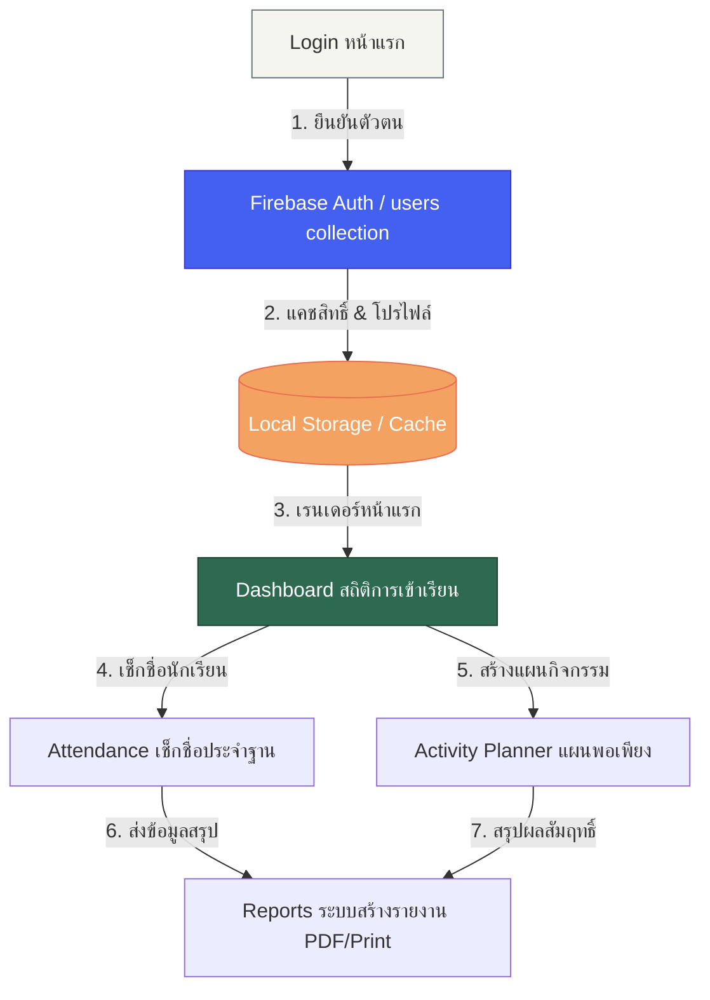
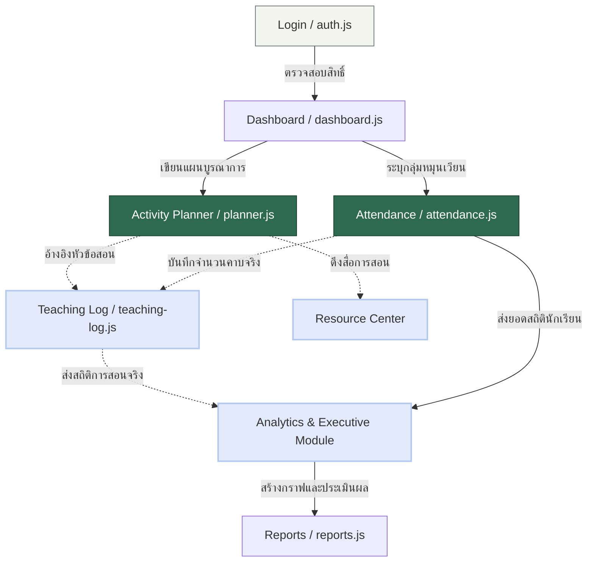
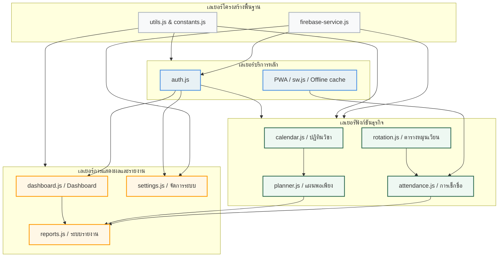

# 🗺️ แผนภาพความเกี่ยวเนื่องระหว่างโมดูล (Module Dependency Map)

**Academic Management Platform (AMP)** — โรงเรียนไพวิทยาคาร | Version: v2.2.0

เอกสารนี้รวบรวมแผนภาพ Mermaid.js เพื่อแสดงทิศทางการไหลของข้อมูล (Data Flow) และโครงสร้างความเกี่ยวเนื่องระหว่างโมดูล (Module Dependencies) ทั้งในระบบปัจจุบันและสถาปัตยกรรมเป้าหมายในอนาคต

> [!NOTE]
> **Cross-reference:** ดูรายละเอียดไฟล์และการย้ายใน [ARCHITECTURE_REFACTOR_PLAN.md](./ARCHITECTURE_REFACTOR_PLAN.md) และโครงสร้าง collections ใน [DATABASE.md](./DATABASE.md)

---

## 1. 🔄 การไหลของข้อมูลในปัจจุบัน (Current Data Flow v2.2.0)

ในเวอร์ชันปัจจุบัน ข้อมูลส่วนใหญ่จะไหลผ่านคลาสศูนย์กลาง (`AttendanceApp` ใน `app.js`) และบันทึกผ่าน Firebase SDK หรือ Local Cache ก่อนส่งผ่านไปยังมุมมองต่าง ๆ

---

## 2. 🔮 การไหลของข้อมูลในอนาคต (Future AMP Data Flow)

ในสถาปัตยกรรมเป้าหมาย การไหลของข้อมูลจะถูกเชื่อมต่อเข้ากับโมดูลใหม่ ๆ (Teaching Log, Resource Center, Analytics) เพื่อรองรับการทำงานระยะยาว

---

## 3. 🏗️ แผนผังความเกี่ยวเนื่องเชิงโมดูล (Module Dependency Structure)

แผนภาพนี้แสดงให้เห็นว่าโมดูลหลักแต่ละส่วนมีการอ้างอิงข้อมูลและการพึ่งพาซึ่งกันและกัน (Dependencies) อย่างไร โดยมี **Firebase Service** และ **Utilities** เป็นรากฐานสำคัญของระบบ

---

## 🔒 กฎความปลอดภัยและการข้ามขอบเขตโมดูล (Module Boundaries)

> [!WARNING]
> เพื่อไม่ให้ระบบเกิดสภาวะการพึ่งพากันแบบวงกลม (Circular Dependencies) ทุกโมดูลต้องปฏิบัติตามกฎต่อไปนี้:
> 1. **ห้ามโมดูลในระดับฟังก์ชันธุรกิจอ้างอิงข้ามกันโดยตรง** — หากจำเป็น ต้องเรียกผ่านตัวกลางหรือส่งผ่านเป็น parameter
> 2. **ห้ามโมดูลภายนอกแก้ไขตัวแปรคงที่ (Constants)** — constants.js ต้องมีสถานะเป็น read-only
> 3. **Firebase calls ต้องผ่าน firebase-service.js เท่านั้น** — ห้ามโมดูล UI เรียกใช้ `firebase.firestore()` โดยตรงในอนาคต
