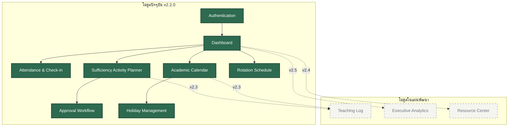

# 🗺️ แผนผังโมดูลระบบ (Module Map)

**Academic Management Platform (AMP)** — โรงเรียนไพวิทยาคาร | Version: v2.2.0

เอกสารนี้แสดงโครงสร้าง แผนผัง และความสัมพันธ์ระหว่างโมดูลต่าง ๆ ในระบบ ทั้งโมดูลปัจจุบันและโมดูลที่วางแผนจะพัฒนาในอนาคต

> [!NOTE]
> **Cross-reference:** ดู [ARCHITECTURE.md](./ARCHITECTURE.md) สำหรับสถาปัตยกรรมระบบ, [DATABASE.md](./DATABASE.md) สำหรับโครงสร้างตารางข้อมูล และ [ROADMAP.md](./ROADMAP.md) สำหรับลำดับการพัฒนาในอนาคต

---

## 📊 แผนผังความเชื่อมโยงโมดูล (Module Diagram)

---

## 📋 รายละเอียดโมดูลระบบ

### 1. Authentication (การยืนยันตัวตน)
- **สถานะ:** ✅ เปิดใช้งาน (Active)
- **หน้าที่หลัก:**
  - ลงทะเบียนและตรวจสอบสิทธิ์การเข้าสู่ระบบผ่าน Firebase Authentication (Email/Password)
  - ดึงข้อมูลสิทธิ์การใช้งาน (Roles) จาก Firestore collection `users`
  - ตรวจสอบและบังคับให้ผู้ใช้งานเปลี่ยน Password เมื่อเข้าใช้งานครั้งแรก (Password Reset Enforce)
- **ไฟล์สำคัญ:** `app.js` (ฟังก์ชัน: `initApp`, `loginUser`, `logoutUser`, `showPasswordChangeModal`)
- **การเข้าถึง (Roles):** ทุกกลุ่มผู้ใช้ (Guest, Teacher, Supervisor, Director, Admin)

### 2. Dashboard (แผงควบคุมระบบ)
- **สถานะ:** ✅ เปิดใช้งาน (Active)
- **หน้าที่หลัก:**
  - แสดงจำนวนสถิติและตัวชี้วัดหลักตามบทบาทของผู้ใช้ (เช่น แสดงสถิติการเข้าเรียนสรุป, จำนวนแผนที่รออนุมัติ)
  - ใช้ **Chart.js** ในการวาดกราฟแนวโน้มการเข้าเรียน รายวัน รายสัปดาห์ และรายเดือน
  - ทำหน้าที่เป็น Home Screen หลังผ่านการ Login
- **ไฟล์สำคัญ:** `app.js` (ฟังก์ชัน: `renderDashboard`, `loadDashboardStats`)
- **การเข้าถึง (Roles):** ทุกกลุ่มผู้ใช้ (ข้อมูลที่แสดงจะถูกกรองตามบทบาท)

### 3. Attendance (การเช็กชื่อ/การเข้าร่วมกิจกรรม)
- **สถานะ:** ✅ เปิดใช้งาน (Active)
- **หน้าที่หลัก:**
  - อำนวยความสะดวกให้ครูเช็กชื่อนักเรียนเข้าเรียนในแต่ละฐานการเรียนรู้
  - รองรับระบบ **Offline Mode** โดยการบันทึกลง Local Staging Queue ในเครื่องก่อน เมื่อระบบเชื่อมต่ออินเทอร์เน็ตได้จะทำการ Sync ไปยัง Firestore collection `attendance_logs` อัตโนมัติ
- **ไฟล์สำคัญ:** `app.js` (ฟังก์ชัน: `renderAttendance`, `saveAttendance`, `syncOfflineQueue`, `checkOnlineStatus`)
- **การเข้าถึง (Roles):** Teacher (เขียนเฉพาะฐานตนเอง), Admin (จัดการทั้งหมด), Director/Supervisor (อ่านเท่านั้น)

### 4. Rotation Schedule (ตารางหมุนเวียนฐาน)
- **สถานะ:** ✅ เปิดใช้งาน (Active)
- **หน้าที่หลัก:**
  - สร้างและจัดการความถี่ในการสลับสับเปลี่ยนฐานเรียนรู้ของนักเรียน ม.1 - ม.6
  - มีระบบคำนวณสลับฐานอัตโนมัติ (Auto-Rotation Matrix) ตามแผนการศึกษา
- **ไฟล์สำคัญ:** `app.js` (ฟังก์ชัน: `renderRotationSchedule`, `generateRotationMatrix`)
- **การเข้าถึง (Roles):** Admin (จัดการและแก้ไข), Roles อื่น ๆ (อ่านอย่างเดียว)

### 5. Academic Calendar (ปฏิทินรายวิชา)
- **สถานะ:** ✅ เปิดใช้งาน (Active)
- **หน้าที่หลัก:**
  - ช่วยเหลือครูผู้สอนในการออกแบบปฏิทินแผนการเรียนรู้ตลอดภาคเรียนผ่าน **5-Step Wizard**
  - แสดงแผนการจัดกิจกรรมพร้อมระบุสถานะการสอน (Taught, Cancelled, Make-up)
- **ไฟล์สำคัญ:** `app.js` (ฟังก์ชัน: `renderCalendarWizard`, `saveSubjectCalendar`)
- **การเข้าถึง (Roles):** Teacher (เขียนเฉพาะปฏิทินตนเอง), Admin (จัดการทั้งหมด), Director/Supervisor (อ่านเท่านั้น)

### 6. Holiday Management (ระบบจัดการวันหยุด)
- **สถานะ:** ✅ เปิดใช้งาน (Active) — เป็นโมดูลย่อยในปฏิทินรายวิชา
- **หน้าที่หลัก:**
  - กำหนดวันหยุดประจำปีของสถานศึกษา เพื่อให้ระบบคำนวณและเลื่อนวันสอนจริงในปฏิทินโดยไม่นับวันหยุด
- **ไฟล์สำคัญ:** `app.js` (ฟังก์ชัน: `renderHolidayManager`)
- **การเข้าถึง (Roles):** Admin (จัดการวันหยุดส่วนกลาง), Teacher (ดึงไปคำนวณใน Wizard)

### 7. Sufficiency Activity Planner (แผนกิจกรรมพอเพียง)
- **สถานะ:** ✅ เปิดใช้งาน (Active) — ชื่อเดิมคือ Lesson Planner
- **หน้าที่หลัก:**
  - บันทึกรายละเอียดแผนการจัดกิจกรรมการเรียนรู้
  - นำกรอบแนวคิด **Framework 2-3-4-3-4** มาสร้างเป็น Checkbox Matrix ให้ครูเลือกบูรณาการ
  - จัดการแสดงผล Framework Badges ในหน้ารายละเอียดแผนอย่างสวยงาม
- **ไฟล์สำคัญ:** `app.js` (ฟังก์ชัน: `renderLessonPlanForm`, `saveLessonPlan`, `renderLessonPlanDetail`)
- **การเข้าถึง (Roles):** Teacher (สร้าง/แก้ไขแผนตนเอง), Director/Supervisor (อ่านและอนุมัติ)

### 8. Approval Workflow (การอนุมัติแผน)
- **สถานะ:** ✅ เปิดใช้งาน (Active)
- **หน้าที่หลัก:**
  - ควบคุมการปรับสถานะของแผนกิจกรรม: `draft` -> `pending` -> `approved` / `rejected`
  - ครูสามารถส่งคำขออนุมัติ, ผู้บริหาร (Director/Supervisor) สามารถกดยอมรับ หรือตีกลับพร้อมแนบความคิดเห็น (Comments)
- **ไฟล์สำคัญ:** `app.js` (ฟังก์ชัน: `submitForApproval`, `approveLessonPlan`, `rejectLessonPlan`)
- **การเข้าถึง (Roles):** Teacher (ผู้ส่ง), Director/Supervisor (ผู้อนุมัติ)

---

## 🔮 โมดูลที่จะพัฒนาในอนาคต (Planned Modules)

### 9. Teaching Log (บันทึกการสอนจริง — v2.3)
- **บทบาท:** เชื่อมโยงรายละเอียดการจัดการเรียนรู้รายวันจริงเข้ากับปฏิทินวิชา (`subject_calendars`) และแผนกิจกรรม (`lesson_plans`) เพื่อเก็บประวัติการสอนจริง สื่อที่ใช้ และปัญหาที่พบ

### 10. Resource Center (ศูนย์ทรัพยากรการเรียนรู้ — v2.4)
- **บทบาท:** คลังเก็บและแบ่งปันสื่อประกอบการสอน (เอกสาร PDF, ลิงก์วิดีโอ, PowerPoint) เพื่อช่วยเหลือครูผู้สอนในการแลกเปลี่ยนเครื่องมือการสอน

### 11. Executive Analytics (การวิเคราะห์ระดับบริหาร — v2.5)
- **บทบาท:** โมดูลแสดงสถิติและพยากรณ์ข้อมูลระดับสูงสำหรับผู้บริหาร ช่วยดึงรายงานประเมินความสำเร็จของกิจกรรมการเข้าเรียน และผลสัมฤทธิ์การบูรณาการหลักเศรษฐกิจพอเพียง
