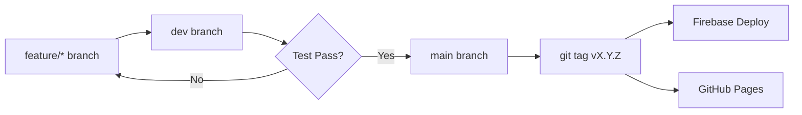

# 🚀 กระบวนการ Release — Academic Management Platform (AMP)

**โรงเรียนไพวิทยาคาร** | Version ปัจจุบัน: v2.2.0

เอกสารนี้อธิบาย Release Cycle, Checklist, และ Versioning Policy สำหรับโปรเจกต์ AMP

---

## ภาพรวมขั้นตอนการ Release



**ขั้นตอนหลัก:**
1. พัฒนา Feature ใน `feature/*` branches (ทีละ Sprint)
2. Merge ไปยัง `dev` branch
3. ทดสอบใน `dev` — รัน verification checklist ทั้งหมด
4. Merge ไปยัง `main` branch เมื่อผ่านทุก test
5. สร้าง Tag และ Push
6. Deploy ไปยัง Firebase และ/หรือ GitHub Pages

---

## ✅ Checklist: ก่อน Release (สำหรับ Developer)

> [!IMPORTANT]
> ต้องผ่านทุกรายการนี้ก่อนสร้าง Tag ทุกครั้ง

- [ ] รัน `node -c app.js` — ต้องไม่มี syntax error
- [ ] รัน integration tests ผ่านทั้งหมด
- [ ] ตรวจสอบ backward compatibility กับข้อมูลเก่าใน Firestore
- [ ] อัปเดต `CHANGELOG.md` ด้วยรายการที่เปลี่ยนแปลงครบถ้วน
- [ ] อัปเดต version number ใน `README.md`
- [ ] สร้าง `walkthrough.md` สรุปการเปลี่ยนแปลงใน Sprint นี้
- [ ] Code review สำหรับ major features
- [ ] Security review สำหรับ Firestore rules ที่เปลี่ยนแปลง

---

## 🏷️ Checklist: ก่อน Tag

- [ ] `git status` คลีน — ไม่มี uncommitted changes
- [ ] ยืนยัน version number ใน `README.md` ตรงกับ Tag ที่จะสร้าง
- [ ] `git push origin main` สำเร็จแล้ว
- [ ] `git tag vX.Y.Z`
- [ ] `git push origin vX.Y.Z`

---

## 🔥 Checklist: ก่อน Firebase Deploy

- [ ] ตรวจสอบ `firebase.json` config ถูกต้อง
- [ ] ตรวจสอบ `firestore.rules` เป็น version ล่าสุด
- [ ] ใช้ `firebase deploy --only hosting` สำหรับ Hosting เท่านั้น
- [ ] ใช้ `firebase deploy` เมื่อต้องอัปเดตทั้ง rules, indexes, และ hosting พร้อมกัน

---

## 🌐 Checklist: ก่อน GitHub Pages Deploy

- [ ] Push ไปยัง `main` เรียบร้อยแล้ว
- [ ] ตรวจสอบ GitHub Actions workflow (ถ้ามีการตั้งค่า)
- [ ] เปิด GitHub Pages URL หลัง deploy เสร็จ

---

## 🎯 Checklist: หลัง Release

- [ ] ตรวจสอบ production URL ทำงานถูกต้อง (Login, Attendance, Plans)
- [ ] Login ด้วยทุก role และตรวจสอบ permissions
- [ ] ทดสอบ offline mode (ปิด Internet แล้วทดสอบ Service Worker)
- [ ] อัปเดต GitHub Release Notes พร้อม Changelog สรุป
- [ ] แจ้งทีมว่า deploy สำเร็จแล้ว

---

## 💻 คำสั่ง Git สำหรับ Release

```bash
# อัปเดต branch หลัก
git checkout main
git pull origin main

# Commit เอกสารสุดท้าย (CHANGELOG, README, walkthrough)
git add .
git commit -m "docs: update CHANGELOG and README for vX.Y.Z"
git push origin main

# สร้าง Tag และ push
git tag vX.Y.Z
git push origin vX.Y.Z

# Deploy ไปยัง Firebase
firebase deploy
```

---

## 📦 Versioning Policy

ใช้ **Semantic Versioning (MAJOR.MINOR.PATCH)**

| Component | เปลี่ยนเมื่อ | ตัวอย่าง |
|---|---|---|
| **MAJOR** | Architecture เปลี่ยน หรือ incompatible breaking changes | v2.x.x → v3.0.0 |
| **MINOR** | เพิ่ม features ใหม่ที่ backward compatible | v2.1.x → v2.2.0 |
| **PATCH** | แก้ไข bug หรืออัปเดตเอกสาร | v2.2.0 → v2.2.1 |

---

## 📋 ประวัติการ Release

| Version | วันที่ | สรุป |
|---|---|---|
| **v2.2.0** | 2026-07-06 | ✅ Sufficiency Activity Planner + Framework 2-3-4-3-4 |
| v2.1.0 | 2026-07-02 | Lesson Planner + Approval Workflow |
| v2.0.1 | 2026-07-01 | Startup Fix + Academic Calendar Module |
| v1.2.0 | 2026-06-21 | Rotation Schedule Builder |
| v1.1.0 | 2026-06-20 | Subject Calendar Wizard |
| v1.0.0 | 2026-06-19 | Core Attendance System |

---

## 🔗 ลิงก์ที่เกี่ยวข้อง

- [CHANGELOG.md](./CHANGELOG.md) — รายละเอียดการเปลี่ยนแปลงทุก version
- [CONTRIBUTING.md](./CONTRIBUTING.md) — มาตรฐานการพัฒนาและ AI Development Charter
- [ARCHITECTURE.md](./ARCHITECTURE.md) — สถาปัตยกรรมระบบ
- [SECURITY.md](./SECURITY.md) — นโยบายความปลอดภัย
