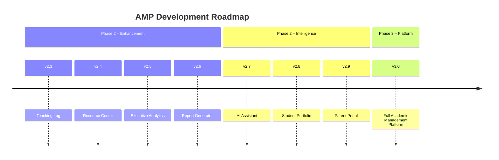
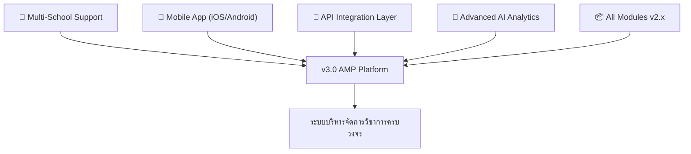

# ROADMAP — Academic Management Platform (AMP)
### โรงเรียนไพวิทยาคาร

---

## บทนำ

เอกสารนี้อธิบายแผนการพัฒนา **Academic Management Platform (AMP)** ของโรงเรียนไพวิทยาคารในระยะถัดไป ทุก version ที่ระบุไว้แสดงถึงกลุ่ม feature ที่วางแผนไว้ล่วงหน้า เรียงตามลำดับความสำคัญและความพร้อมของทีมพัฒนา เนื้อหาในเอกสารนี้อาจมีการปรับปรุงได้ตามความต้องการของโรงเรียนและ feedback จากผู้ใช้งานจริง

> [!NOTE]
> ROADMAP นี้ต่อเนื่องจาก **v2.2** (ระบบปฏิทินกิจกรรมและแผนกิจกรรมพอเพียง) ซึ่งเป็น version ปัจจุบัน

---

## แผนการพัฒนาตามเวอร์ชัน



---

## v2.3 – Teaching Log (บันทึกการสอน)

> ช่วยให้ครูสามารถบันทึกรายละเอียดการสอนในแต่ละคาบได้อย่างเป็นระบบ และนำข้อมูลไปใช้ประกอบการประเมินผลได้

| Feature | รายละเอียด |
|---------|------------|
| 📝 บันทึกรายคาบ | หัวข้อการสอน, วิธีการสอน, สื่อที่ใช้ |
| 📅 เชื่อมปฏิทิน | เชื่อมโยงกับปฏิทินรายวิชา |
| 🔍 ค้นหาและกรอง | ค้นหาและกรองบันทึกการสอนตามเงื่อนไขต่างๆ |
| 📤 Export | Export รายงานการสอนในรูปแบบมาตรฐาน |

**รายการ Feature:**
- บันทึกรายละเอียดการสอนต่อคาบ: หัวข้อ, วิธีการสอน, สื่อที่ใช้
- เชื่อมกับปฏิทินรายวิชา
- ค้นหาและกรองบันทึกการสอน
- Export รายงานการสอน

---

## v2.4 – Resource Center (ศูนย์ทรัพยากร)

> ระบบคลังทรัพยากรการสอนกลาง ให้ครูสามารถ upload, จัดหมวดหมู่ และแชร์สื่อการสอนกันภายในโรงเรียน

| Feature | รายละเอียด |
|---------|------------|
| 🗂️ คลังสื่อการสอน | เก็บสื่อการสอนสำหรับครูทุกคน |
| 📁 Upload & Tag | รองรับไฟล์ PDF, PowerPoint, Video พร้อม tag หมวดหมู่ |
| 🔍 ค้นหาขั้นสูง | ค้นหาตามวิชา ระดับชั้น หรือหัวข้อ |
| 🤝 แชร์ทรัพยากร | แชร์ทรัพยากรระหว่างครูในโรงเรียน |

**รายการ Feature:**
- คลังสื่อการสอนสำหรับครู
- Upload และ tag ไฟล์: PDF, PowerPoint, Video
- ค้นหาตามวิชา ระดับชั้น หรือหัวข้อ
- แชร์ทรัพยากรระหว่างครู

---

## v2.5 – Executive Analytics (วิเคราะห์สำหรับผู้บริหาร)

> Dashboard ระดับผู้บริหาร ให้ภาพรวมสถิติของทั้งโรงเรียนแบบ real-time พร้อมความสามารถ drill-down เพื่อวิเคราะห์เชิงลึก

| Feature | รายละเอียด |
|---------|------------|
| 📊 Dashboard ภาพรวม | สถิติทั้งโรงเรียนในหน้าเดียว |
| 📈 กราฟและแผนภูมิ | กราฟการเข้าร่วมกิจกรรม, ความคืบหน้าแผนกิจกรรม |
| 🔎 Drill-down | วิเคราะห์ตามฐาน, ระดับชั้น, ห้องเรียน |
| 📤 Export | Export รายงาน Excel / PDF |

**รายการ Feature:**
- Dashboard ภาพรวมสถิติทั้งโรงเรียน
- กราฟการเข้าร่วมกิจกรรม, ความคืบหน้าแผนกิจกรรม
- Drill-down ตามฐาน, ระดับชั้น, ห้องเรียน
- Export รายงาน Excel / PDF

---

## v2.6 – Report Generator (ระบบสร้างรายงาน)

> ระบบสร้างรายงานอัตโนมัติและแบบ custom ที่ยืดหยุ่น รองรับทั้งรายงานสำเร็จรูปและการสร้างตาม schedule

| Feature | รายละเอียด |
|---------|------------|
| 📋 Template สำเร็จรูป | Template รายงานมาตรฐานสำหรับโรงเรียน |
| ✏️ Custom Report | สร้างรายงานแบบ Custom ตามความต้องการ |
| 👤 รายงานหลายระดับ | รายงานรายบุคคล, รายห้อง, รายฐาน |
| ⏰ Scheduled Reports | ตั้งค่า Schedule การสร้างรายงานอัตโนมัติ |

**รายการ Feature:**
- Template รายงานสำเร็จรูป
- สร้างรายงานแบบ Custom
- รายงานรายบุคคล, รายห้อง, รายฐาน
- ตั้งค่า Schedule การสร้างรายงานอัตโนมัติ

---

## v2.7 – AI Assistant (ผู้ช่วย AI)

> ผู้ช่วย AI ที่ฝังอยู่ในระบบ ช่วยลดภาระงานเอกสารของครูและให้คำแนะนำที่เชื่อมโยงกับหลักเศรษฐกิจพอเพียง

> [!TIP]
> AI Assistant ในเวอร์ชันนี้จะเน้นการใช้ Large Language Model (LLM) เพื่อช่วยงานเอกสาร ไม่ใช่การตัดสินใจแทนครู

| Feature | รายละเอียด |
|---------|------------|
| ✍️ เขียนวัตถุประสงค์ | ช่วยครูเขียนวัตถุประสงค์การเรียนรู้ |
| 💡 แนะนำกิจกรรม | แนะนำกิจกรรมตามหลักเศรษฐกิจพอเพียง |
| 📝 สรุปบันทึก | สรุปบันทึกการสอนอัตโนมัติ |
| 📊 วิเคราะห์รูปแบบ | วิเคราะห์รูปแบบการเข้าร่วมกิจกรรม |

**รายการ Feature:**
- ช่วยครูเขียนวัตถุประสงค์การเรียนรู้
- แนะนำกิจกรรมตามหลักเศรษฐกิจพอเพียง
- สรุปบันทึกการสอนอัตโนมัติ
- วิเคราะห์รูปแบบการเข้าร่วมกิจกรรม

---

## v2.8 – Student Portfolio (แฟ้มสะสมผลงานนักเรียน)

> ระบบ digital portfolio ให้นักเรียนสะสมผลงานตลอดปีการศึกษา และผู้ปกครองสามารถติดตามได้

| Feature | รายละเอียด |
|---------|------------|
| 🗃️ Digital Portfolio | นักเรียนสะสมผลงานดิจิทัล |
| 🔗 เชื่อมข้อมูล | เชื่อมกับบันทึกการเข้าร่วมกิจกรรมและแผนกิจกรรมพอเพียง |
| 👨‍👩‍👧 ผู้ปกครองดูได้ | ผู้ปกครองเข้าถึงผลงานของบุตรหลาน |
| 📤 Export PDF | Export แฟ้มสะสมผลงานเป็น PDF |

**รายการ Feature:**
- นักเรียนสะสมผลงานดิจิทัล
- เชื่อมกับบันทึกการเข้าร่วมกิจกรรมและแผนกิจกรรมพอเพียง
- ผู้ปกครองดูผลงานได้
- Export แฟ้มสะสมผลงานเป็น PDF

---

## v2.9 – Parent Portal (พอร์ทัลผู้ปกครอง)

> ช่องทางสำหรับผู้ปกครองในการติดตามความก้าวหน้าของบุตรหลานและสื่อสารกับครูโดยตรง

| Feature | รายละเอียด |
|---------|------------|
| 🔐 Login ผู้ปกครอง | ผู้ปกครองเข้าสู่ระบบดูข้อมูลบุตรหลาน |
| 🔔 Push Notification | แจ้งเตือนเมื่อบุตรหลานขาดกิจกรรม |
| 📚 ดูผลการเรียน | ดูผลการเรียนและแฟ้มสะสมผลงาน |
| 💬 ช่องทางสื่อสาร | ช่องทางสื่อสารครู-ผู้ปกครอง |

**รายการ Feature:**
- ผู้ปกครองเข้าสู่ระบบดูข้อมูลบุตรหลาน
- แจ้งเตือน Push Notification เมื่อบุตรหลานขาดกิจกรรม
- ดูผลการเรียนและแฟ้มสะสมผลงาน
- ช่องทางสื่อสารครู-ผู้ปกครอง

---

## v3.0 – Academic Management Platform (ระบบบริหารจัดการวิชาการครบวงจร)

> เป้าหมายสูงสุดของ roadmap นี้คือการรวม module ทั้งหมดเข้าเป็นแพลตฟอร์มเดียว พร้อมขยายการรองรับหลายโรงเรียนและ mobile app เต็มรูปแบบ

> [!IMPORTANT]
> v3.0 ถือเป็น milestone หลักของโปรเจกต์ ต้องการการวางแผน infrastructure และ architecture อย่างรอบคอบก่อนเริ่มพัฒนา



**รายการ Feature:**
- รวมทุก Module เข้าเป็นระบบเดียว
- Multi-school support
- API สำหรับบูรณาการกับระบบอื่นๆ
- Mobile App (iOS/Android) พร้อม native features
- Advanced AI-powered analytics

---

## ภาพรวม Timeline

```mermaid
gantt
    title AMP Release Timeline (ประมาณการ)
    dateFormat  YYYY-QQ
    axisFormat  %Y Q%q

    section Phase 2 Enhancement
    v2.3 Teaching Log         :2025-Q3, 60d
    v2.4 Resource Center      :2025-Q4, 60d
    v2.5 Executive Analytics  :2026-Q1, 75d
    v2.6 Report Generator     :2026-Q2, 75d

    section Phase 2 Intelligence
    v2.7 AI Assistant         :2026-Q3, 90d
    v2.8 Student Portfolio    :2026-Q4, 90d
    v2.9 Parent Portal        :2027-Q1, 90d

    section Phase 3 Platform
    v3.0 Full AMP Platform    :2027-Q2, 180d
```

---

## ข้อควรทราบเกี่ยวกับกำหนดการ (Timeline Disclaimer)

> [!WARNING]
> กำหนดการทั้งหมดที่ระบุใน ROADMAP นี้เป็น **แผนเบื้องต้น** เท่านั้น อาจมีการเปลี่ยนแปลงได้ตามปัจจัยต่างๆ

กำหนดการและขอบเขต feature ใน ROADMAP นี้เป็นเพียงแผนที่วางไว้ล่วงหน้า และอาจมีการปรับเปลี่ยนได้ด้วยเหตุผลดังต่อไปนี้:

| เหตุผล | รายละเอียด |
|--------|------------|
| 🏫 ความต้องการของโรงเรียน | หาก priority ของโรงเรียนเปลี่ยน feature บางอย่างอาจถูกเลื่อนหรือเพิ่มเข้ามา |
| 👥 Feedback จากผู้ใช้ | ครูและผู้บริหารอาจมีความต้องการที่เปลี่ยนไปหลังจากใช้งานจริง |
| ⚙️ ความซับซ้อนทางเทคนิค | บาง feature อาจต้องใช้เวลาพัฒนามากกว่าที่ประเมินไว้ |
| 📅 ทรัพยากรทีมพัฒนา | กำลังคนและเวลาของทีมส่งผลต่อกำหนดการโดยตรง |
| 🔒 นโยบายและข้อบังคับ | ข้อกำหนดด้านความเป็นส่วนตัวหรือนโยบายของหน่วยงานต้นสังกัด |

**ขอให้ติดตามการอัปเดต ROADMAP นี้อย่างสม่ำเสมอ** ทีมพัฒนาจะแจ้งการเปลี่ยนแปลงที่มีนัยสำคัญผ่านช่องทางการสื่อสารของโรงเรียน

---

*อัปเดตล่าสุด: กรกฎาคม 2026 | Academic Management Platform (AMP) — โรงเรียนไพวิทยาคาร*
