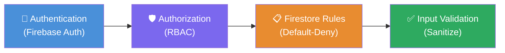

# SECURITY.md — Academic Management Platform (AMP)
### โรงเรียนไพวิทยาคาร | Version: v2.2.0

> [!IMPORTANT]
> เอกสารนี้อธิบายนโยบายและแนวทางความปลอดภัยของระบบ Academic Management Platform (AMP) สำหรับโรงเรียนไพวิทยาคาร โปรดอ่านและปฏิบัติตามอย่างเคร่งครัด

---

## ภาพรวมความปลอดภัย

ระบบ AMP ใช้กลยุทธ์ **"Defense in Depth"** โดยวางชั้นการป้องกันหลายระดับซ้อนกัน เพื่อให้มั่นใจว่าแม้ชั้นใดชั้นหนึ่งถูกเจาะ ชั้นที่เหลือยังคงปกป้องข้อมูลได้:

```
Authentication  ──►  Authorization  ──►  Firestore Rules  ──►  Input Validation
    (ยืนยันตัวตน)      (กำหนดสิทธิ์)       (กฎฐานข้อมูล)        (ตรวจสอบข้อมูล)
```



---

## Authentication (การยืนยันตัวตน)

ระบบใช้ **Firebase Authentication** เป็นกลไกหลักในการยืนยันตัวตนของผู้ใช้ โดยมีนโยบายดังนี้:

| นโยบาย | รายละเอียด |
|---|---|
| **Provider** | Firebase Authentication (email / password) |
| **ความยาว Password** | อย่างน้อย **8 ตัวอักษร** |
| **บังคับเปลี่ยน Password** | ทุก login ครั้งแรกของบัญชีใหม่ |
| **Token Expiry** | Firebase ID Token หมดอายุอัตโนมัติใน **1 ชั่วโมง** |
| **การเก็บ Credentials** | **ห้าม** เก็บ Password ใน LocalStorage หรือ Firestore |

> [!CAUTION]
> ห้ามเก็บ Password, Secret Key, หรือข้อมูลที่ใช้ยืนยันตัวตนใด ๆ ลงใน LocalStorage, SessionStorage, หรือ Firestore ทุกกรณี

---

## Authorization (การกำหนดสิทธิ์)

ระบบใช้ **Role-Based Access Control (RBAC)** ในการควบคุมการเข้าถึงทรัพยากรแต่ละส่วน โดย Role ของผู้ใช้ถูกกำหนดและเก็บไว้ใน Firestore (`users/{uid}.role`)

### ตารางสิทธิ์การเข้าถึง

| Role | การเข้าร่วม | ปฏิทิน | แผนกิจกรรม | Dashboard | จัดการระบบ |
|---|:---:|:---:|:---:|:---:|:---:|
| `admin` | อ่าน+เขียน | อ่าน+เขียน | อ่าน+เขียน | ตั้งค่า | **เต็ม** |
| `teacher` | เขียนเฉพาะของตน | เขียนเฉพาะของตน | เขียน+ส่งอนุมัติ | อ่าน | ✗ |
| `director` | อ่าน | อ่าน | อ่าน+อนุมัติ | อ่าน | ✗ |
| `supervisor` | อ่าน | อ่าน | อ่าน+อนุมัติ | อ่าน | ✗ |
| `guest` | อ่านอย่างเดียว | ✗ | ✗ | อ่าน | ✗ |

### Roles แต่ละ Role อธิบายเพิ่มเติม

- **`admin`** — ผู้ดูแลระบบ: มีสิทธิ์เต็มในทุกส่วนของระบบ รวมถึงการจัดการผู้ใช้และ system configuration
- **`teacher`** — ครู: สามารถจัดการข้อมูลการเข้าร่วม, ปฏิทิน, และแผนกิจกรรมของตัวเองเท่านั้น ไม่สามารถเข้าถึงข้อมูลของครูคนอื่นได้
- **`director`** — ผู้อำนวยการ: สามารถอนุมัติแผนกิจกรรมและดูรายงานได้ทั้งหมด แต่ไม่สามารถแก้ไขข้อมูลได้
- **`supervisor`** — ศึกษานิเทศก์: สามารถอนุมัติแผนกิจกรรมและดูรายงานได้ทั้งหมด แต่ไม่สามารถแก้ไขข้อมูลได้
- **`guest`** — ผู้เยี่ยมชม: อ่านได้เฉพาะ Dashboard เท่านั้น ไม่สามารถเข้าถึงข้อมูลอื่นได้

---

## Firestore Security Rules

กฎ Firestore ของระบบถูกออกแบบตามหลัก **Default-Deny**: ทุกการเข้าถึงถูกปิดกั้นโดยค่าเริ่มต้น ยกเว้นจะระบุสิทธิ์ไว้โดยชัดเจน

> [!NOTE]
> Default-Deny หมายความว่าหาก Collection ใดไม่มีกฎระบุไว้ การเข้าถึงทุกประเภทจะถูกปฏิเสธโดยอัตโนมัติ

### สรุปกฎหลักแต่ละ Collection

| Collection | สิทธิ์อ่าน | สิทธิ์เขียน |
|---|---|---|
| `users` | ทุก authenticated user | `admin` เท่านั้น |
| `students` | ทุก authenticated user | `admin` เท่านั้น |
| `attendance_logs` | `teacher` อ่านเฉพาะของตน / `admin` อ่านทั้งหมด | `teacher` เขียนเฉพาะของตน / `admin` เขียนทั้งหมด |
| `subject_calendars` | `teacher` จัดการของตน / `admin` จัดการทั้งหมด | `teacher` จัดการของตน / `admin` จัดการทั้งหมด |
| `lesson_plans` | `teacher` จัดการของตน / `director`+`supervisor` อ่านและเปลี่ยน status | `teacher` จัดการของตน / `director`+`supervisor` เปลี่ยน status ได้ |
| `system_data` | `admin` เท่านั้น | `admin` เท่านั้น |

### ตัวอย่าง Pattern กฎหลัก

```javascript
// Default-Deny: ปิดกั้นทุกอย่างก่อน
rules_version = '2';
service cloud.firestore {
  match /databases/{database}/documents {

    // ห้ามเข้าถึงทุกอย่างเป็น default
    match /{document=**} {
      allow read, write: if false;
    }

    // users: อ่านได้เฉพาะ authenticated, เขียนได้เฉพาะ admin
    match /users/{userId} {
      allow read: if request.auth != null;
      allow write: if request.auth.token.role == 'admin';
    }

    // attendance_logs: teacher เข้าถึงเฉพาะของตน
    match /attendance_logs/{logId} {
      allow read, write: if request.auth != null
        && (request.auth.uid == resource.data.teacherId
            || request.auth.token.role == 'admin');
    }

    // lesson_plans: director/supervisor อ่านและเปลี่ยน status ได้
    match /lesson_plans/{planId} {
      allow read: if request.auth != null
        && request.auth.token.role in ['admin', 'director', 'supervisor', 'teacher'];
      allow update: if request.auth != null
        && (request.auth.uid == resource.data.teacherId
            || request.auth.token.role in ['admin', 'director', 'supervisor']);
    }
  }
}
```

---

## Offline Security

ระบบรองรับการทำงานแบบ Offline โดยมีนโยบายความปลอดภัยสำหรับข้อมูลที่เก็บบนอุปกรณ์ดังนี้:

- **LocalStorage** เก็บเฉพาะข้อมูลที่จำเป็นสำหรับการทำงาน offline เท่านั้น
- **ห้าม** เก็บ credentials, token, หรือข้อมูลส่วนบุคคล (PII — Personally Identifiable Information) ใน LocalStorage ทุกกรณี
- **Staging queue** ใน LocalStorage (ข้อมูลที่รอ sync) จะถูกลบออกทันทีหลังจาก sync สำเร็จแล้ว

```
[Offline Action] ──► [Staging Queue / LocalStorage] ──► [Sync to Firestore] ──► [ลบออกจาก LocalStorage]
```

> [!WARNING]
> ห้ามเพิ่ม field ที่มี credentials หรือ token ลงใน staging queue ใด ๆ ที่เก็บใน LocalStorage

---

## Input Validation

เพื่อป้องกันการโจมตีประเภท **XSS (Cross-Site Scripting)** และความเสียหายของข้อมูล ระบบกำหนดให้:

- ทุก user input ต้องผ่านการ **sanitize** ก่อนนำไป render ด้วย `innerHTML` ทุกครั้ง
- ตรวจสอบ **ประเภทข้อมูล (data type)** และ **รูปแบบ (format)** ก่อน write ลง Firestore ทุกครั้ง

### แนวทาง Sanitization

```javascript
// ❌ ห้ามทำ: render user input โดยตรง
element.innerHTML = userInput;

// ✅ ควรทำ: sanitize ก่อนเสมอ
element.innerHTML = DOMPurify.sanitize(userInput);

// ✅ หรือใช้ textContent แทนสำหรับ plain text
element.textContent = userInput;
```

---

## ความเสี่ยงที่รู้จักและการแก้ไข

ตารางด้านล่างสรุปความเสี่ยงด้านความปลอดภัยที่ได้รับการระบุแล้ว พร้อมสถานะการแก้ไข:

| ความเสี่ยง | คำอธิบาย | การแก้ไขปัจจุบัน | แผนการแก้ไข |
|---|---|---|---|
| **DOM XSS** | ใช้ `innerHTML` อย่างแพร่หลายในการ render | ต้อง sanitize input เสมอ *(ความรับผิดชอบของ developer)* | Planned: v2.3 — นำ `DOMPurify` มาใช้ทั่วทั้งโปรเจกต์ |
| **CSRF** | Cross-Site Request Forgery | Firebase SDK จัดการให้อัตโนมัติผ่าน token-based requests | ✅ แก้ไขแล้ว |
| **Data Exposure** | การเข้าถึงข้อมูลโดยไม่ได้รับอนุญาต | Firestore Security Rules (Default-Deny) ป้องกันอยู่ | ✅ แก้ไขแล้ว |

> [!CAUTION]
> ความเสี่ยง **DOM XSS** ยังคงเป็นความเสี่ยงที่ต้องระวัง developer ทุกคนต้องมีความรับผิดชอบในการ sanitize input ทุกครั้งก่อน v2.3

---

## การรายงานช่องโหว่ด้านความปลอดภัย

หากพบช่องโหว่หรือปัญหาด้านความปลอดภัยในระบบ โปรด **อย่าเปิดเผยต่อสาธารณะ** และรายงานผ่านช่องทางต่อไปนี้:

1. แจ้งโดยตรงต่อ **ผู้ดูแลระบบ (admin)** ของโรงเรียนไพวิทยาคาร
2. ระบุรายละเอียด: ประเภทช่องโหว่, ขั้นตอนการทำซ้ำ (steps to reproduce), และผลกระทบที่อาจเกิดขึ้น

---

*เอกสารนี้อัปเดตล่าสุดสำหรับ **AMP v2.2.0** — Academic Management Platform โรงเรียนไพวิทยาคาร*
